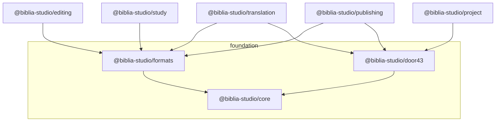

# Package map

Workspace packages under `@biblia-studio/*` are **intentionally bounded** by concern. They may depend on each other acyclically (e.g. higher-level tools depend on `formats` and `door43`, not the reverse). **Multiple** `apps/*` products are expected to **reuse** the same packages so we do not fork domain logic per app.

**Evolving boundaries:** When starting new work, you do not need the final package split on day one. Follow [New project / initiative workflow](./11-new-project-workflow.md) and **update this document** when responsibilities shift or new packages are promoted from apps.

**Apps** (`apps/*`) compose use cases with **ports and adapters** ([hexagonal architecture](./05-hexagonal-apps.md)); `@biblia-studio/*` packages often supply **driven-side** building blocks (e.g. Door43) that adapters implement behind a port.

**`apps/web`** — `src/ports` holds driven **port** types (e.g. public Door43 repo search, Translation Helps catalog); `src/adapters/driven` implements them by calling `@biblia-studio/door43`, `@biblia-studio/translation`, etc. Route modules under `app/` stay thin and call those adapters.

## Foundation

| Package                  | Folder             | Responsibility                                                                                                                                                                                                                                                                                                                                                                              |
| ------------------------ | ------------------ | ------------------------------------------------------------------------------------------------------------------------------------------------------------------------------------------------------------------------------------------------------------------------------------------------------------------------------------------------------------------------------------------- |
| `@biblia-studio/core`    | `packages/core`    | Shared types, constants, and cross-cutting helpers that are not format- or API-specific.                                                                                                                                                                                                                                                                                                    |
| `@biblia-studio/formats` | `packages/formats` | Scripture and resource **formats**: **USFM v1** parse/serialize (`parseUsfm` / `serializeUsfm`, minimal marker allowlist in package README), USFM/USX boundaries, Resource Container metadata, alignment with [collab format guides](https://github.com/unfoldingWord/uW-Tools-Collab/tree/main/docs).                                                                                      |
| `@biblia-studio/door43`  | `packages/door43`  | **Door43 integration**: Gitea repo search/version; **catalog search** (`/api/v1/catalog/search`) for **`tc-ready`** Translation Helps discovery (`listTcReadyTranslationHelpsResources`) — see [door43 README](../packages/door43/README.md). Spec: [swagger.v1.json](https://git.door43.org/swagger.v1.json); guides: [uW-Tools-Collab](https://github.com/unfoldingWord/uW-Tools-Collab). |

## Bible-tool domains

| Package                      | Folder                 | Responsibility                                                                                                                                                                                                                                                                                                                                                                                                                                                                                                                                                                                                                       |
| ---------------------------- | ---------------------- | ------------------------------------------------------------------------------------------------------------------------------------------------------------------------------------------------------------------------------------------------------------------------------------------------------------------------------------------------------------------------------------------------------------------------------------------------------------------------------------------------------------------------------------------------------------------------------------------------------------------------------------ |
| `@biblia-studio/editing`     | `packages/editing`     | Translation **editing**: ProseMirror scripture schema (`scriptureSchema`) and USFM ↔ PM bridge (`usfmDocumentToPmDoc`, `pmDocToUsfmDocument`); consumes `formats` only.                                                                                                                                                                                                                                                                                                                                                                                                                                                              |
| `@biblia-studio/translation` | `packages/translation` | **Translation** workflow concepts: checks, progress, roles, handoffs — without owning full UI. **Catalog:** **`compareGlToGlTcReadyTranslationHelps`**; **`compareTcReadySourceResourcesToTarget`** (explicit source list × target language); **`compareGlToGlTcReadyBookProjects`** (metadata **`projects`** book ids); **`findTargetCatalogEntriesClaimingSource`** (metadata **`source`**). **API reference:** [Translation helps domain API](./18-translation-helps-domain-api.md). **Doc target:** full **book × helps** matrix + **tag vs default branch** WIP — [Translation Helps](./17-translation-helps-and-resources.md). |
| `@biblia-studio/project`     | `packages/project`     | **Project management**: organizations, repositories, milestones, assignments — orchestration over `door43` and metadata.                                                                                                                                                                                                                                                                                                                                                                                                                                                                                                             |
| `@biblia-studio/study`       | `packages/study`       | **Study** tools: scripture + helps composition (notes, words, questions, academy links) using `formats`. May compose UX aligned with **[FIA](https://fia.bible/about)** where product requires it ([ecosystem references](./01-ecosystem-references.md)).                                                                                                                                                                                                                                                                                                                                                                            |
| `@biblia-studio/publishing`  | `packages/publishing`  | **Publishing** pipelines: validation packs, export targets, readiness checks.                                                                                                                                                                                                                                                                                                                                                                                                                                                                                                                                                        |

## Shared Turborepo utilities (starter)

| Package                                           | Role                                                                                                                                              |
| ------------------------------------------------- | ------------------------------------------------------------------------------------------------------------------------------------------------- |
| `@repo/ui`                                        | Shared React components for apps; follows [UI philosophy](./04-ui-philosophy.md) ([Argyle](https://nerdy.dev/headless-boneless-and-skinless-ui)). |
| `@repo/eslint-config` / `@repo/typescript-config` | Lint and TS configuration.                                                                                                                        |

## Dependency sketch

Exact imports will evolve; keep **foundation → domains** direction to avoid cycles.
