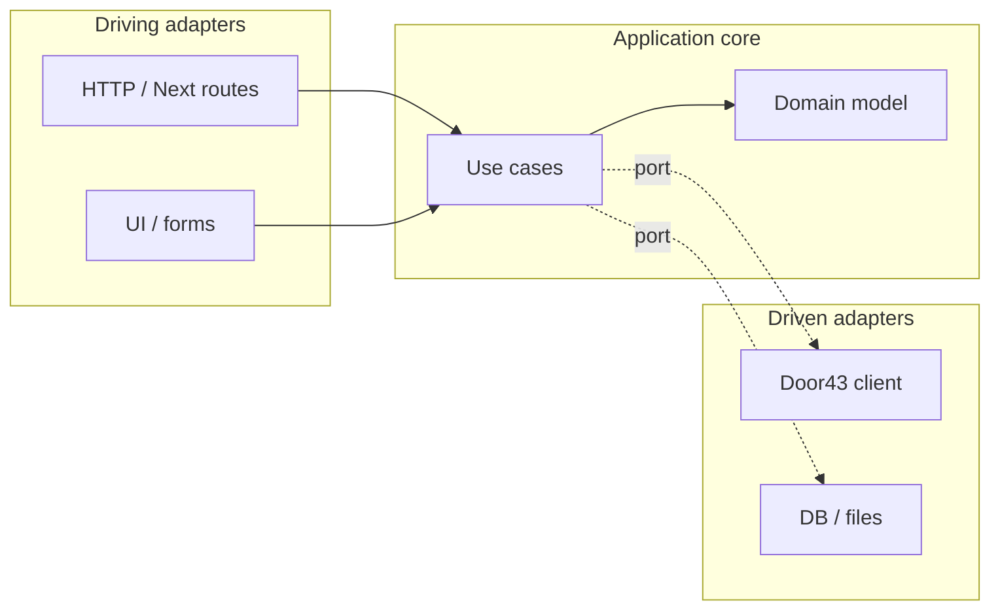

# Hexagonal architecture (apps)

Applications under `apps/*` follow **hexagonal architecture** (ports and adapters), as described by Alistair Cockburn in [Hexagonal Architecture](https://alistair.cockburn.us/hexagonal-architecture/). The goal is to keep **application/domain rules** independent of **delivery mechanisms** (HTTP, React, CLI) and **infrastructure** (Door43, databases, filesystem).

## Core ideas

| Concept                       | Role                                                                                                                                                                     |
| ----------------------------- | ------------------------------------------------------------------------------------------------------------------------------------------------------------------------ |
| **Domain / application core** | Entities, value objects, and **use cases** (application services). No imports from Next.js, React, or `fetch` in the core — only pure rules and orchestration.           |
| **Ports**                     | **Interfaces** the core defines: “what I need from the outside world” (driven) or “how the outside world invokes me” (driving, often implicit as use-case entry points). |
| **Adapters**                  | **Implementations** of ports: translate between the core and concrete technologies.                                                                                      |

## Driving vs driven

- **Driving (primary) adapters** push events **into** the system: route handlers, server actions, CLI commands, queue consumers. They parse input, call a use case, map results/errors to the transport (JSON, redirect, UI state).
- **Driven (secondary) adapters** fulfill **outbound** ports: HTTP clients to Door43, persistence, file IO, clock, ID generation. The core depends on **abstractions**; adapters implement them.



## How this maps to Biblia Studio

1. **`apps/*` own composition** — Each app wires **which adapter implements which port** (dependency injection / factories at the edge). The core does not choose concrete Door43 or storage implementations.
2. **`@biblia-studio/*` is shared machinery** — Packages such as [`@biblia-studio/door43`](./02-package-map.md) provide **real infrastructure** and types that **driven adapters** can wrap behind a port. Domain-heavy logic that is reused across apps can live in those packages **as long as it stays free of app-specific composition**; alternatively, keep portable use cases in a package and treat them as part of the core when imported by an app.
3. **UI follows [UI philosophy](./04-ui-philosophy.md)** — Presentation is a **driving** concern: React components and routes call use cases; they do not embed Door43 URLs or parsing rules inline.
4. **Tests** — Unit-test the core against **in-memory or fake adapters**; integration-test **real adapters** (e.g. Door43 sandbox) at the edges.

## Folder shape (convention, not enforced yet)

Apps may evolve a structure like:

```text
apps/web/
  src/
    domain/           # entities, value objects (optional package later)
    application/      # use cases; depend on port types only
    ports/            # interfaces (driven ports); or colocated with application
    adapters/
      driving/        # Next route handlers, server actions → use cases
      driven/         # Door43, storage — implement ports
    app/                # Next.js App Router UI (calls driving adapters / use cases)
```

Exact naming is up to each app; the **rule** is: **dependencies point inward** — from adapters and UI toward the core, not the reverse.

## References

- Alistair Cockburn, [Hexagonal Architecture](https://alistair.cockburn.us/hexagonal-architecture/).
- Related terms: **ports & adapters**, **clean architecture** (similar dependency rule; layering details differ).
