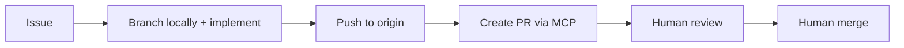

# GitHub workflow (agents + MCP)

This is the **default delivery workflow** for Biblia Studio when using **Cursor Agent** with the **GitHub MCP**. It keeps work **issue-driven**, **reviewable**, and **traceable**.

**Repository:** `abelpz/biblia-studio` (adjust `owner` / `repo` if you fork or move).

In Cursor, the MCP server may appear as **`project-0-biblia-studio-github`** (or similar); tool **names** below are stable.

## Principles

1. **Every change ties to an Issue** — No drive-by work without a number to cite in the PR.
2. **One PR per issue** (or one clearly scoped PR that lists every issue it closes).
3. **Humans merge** — Agents open PRs; **do not** `merge_pull_request` unless a maintainer explicitly asks in that task.
4. **Draft first** — Open the PR as **draft** until `lint` / `check-types` / `build` (as applicable) are noted in the PR body.
5. **Local git for real edits** — Implement in the workspace, run Bun/Turbo locally, **push** with the terminal; use MCP for **issues, comments, and PR metadata** (not as a substitute for normal commits on large changes).

## Suggested GitHub labels

Create these in the repo if they do not exist (Settings → Labels):

| Label                             | Meaning                                       |
| --------------------------------- | --------------------------------------------- |
| `agent`                           | Suitable for an AI agent to pick up           |
| `needs-triage`                    | Human must refine scope before implementation |
| `needs-human-review`              | PR or issue blocked on human decision         |
| `chore` / `docs` / `feat` / `fix` | Optional type tags                            |

## End-to-end flow



### 1. Intake (human or agent)

- **Human:** Create the issue with acceptance criteria, links to `docs/`, and label `agent` when ready.
- **Agent:** If asked to file work, use **`issue_write`** with `method: "create"`, `owner`, `repo`, `title`, `body`, and labels (e.g. `agent`, `needs-triage`).

### 2. Understand

- **`issue_read`** — `method: "get"` for the issue body and metadata.
- **`issue_read`** — `method: "get_comments"` if discussion matters.
- **`list_issues`** or **`search_issues`** — find the next `agent` issue (optional).

### 3. Branch (local, recommended)

From the repo root, sync and branch:

```bash
git fetch origin
git checkout main
git pull origin main
git checkout -b agent/42-short-slug
```

Use **`issue number`** in the branch name (e.g. `agent/42-add-door43-client`).

**Optional (GitHub-side branch):** **`create_branch`** with `owner`, `repo`, `branch`, and optional `from_branch`, then `git fetch` and check out the new branch locally. Use when you want the branch to exist on GitHub before any local commit.

### 4. Implement

Follow **`AGENTS.md`**, hexagonal rules, and UI philosophy. Commit with conventional messages, e.g. `feat(door43): add repo discovery (#42)`.

Before you treat a **step** as done (or before you push / open the PR), run the [**closure checklist** in `AGENTS.md`](../AGENTS.md#after-each-step-closure-checklist): update package map, READMEs, workflow docs, and issue/PR metadata that the step invalidated — not only the code.

### 5. Push

```bash
git push -u origin agent/42-short-slug
```

### 6. Open a pull request (MCP)

Use **`create_pull_request`** with:

- `owner`, `repo`
- `title` — concise; include `(#NN)` if helpful
- `head` — your pushed branch name
- `base` — usually `main`
- `body` — must include:
  - **`Closes #NN`** (or `Fixes #NN`) so GitHub links the issue
  - What changed, commands run (`bun run lint`, `bun run check-types`, `bun run build`)
  - Risks / follow-ups for the human reviewer
- `draft: true` — until you are ready for review (then update via **`update_pull_request`** or the GitHub UI)

### 7. Keep the issue in sync (MCP)

- **`add_issue_comment`** — short updates (e.g. “Opened draft PR #57”, “Blocked on API scope decision”).
- When scope changes, **`issue_write`** `method: "update"` (title/body/labels) with human agreement.

### 8. Review and merge (human)

- Human reviews, requests changes, or approves.
- **CI** must be green — the repo runs `lint`, `check-types`, and `build` on every PR ([`ci.yml`](../../.github/workflows/ci.yml)); see [CI & branch protection](./09-ci-and-branch-protection.md).
- **Agent:** address review with new commits + optional **`add_issue_comment`** / PR discussion (PR comments can use issue-style tools where applicable; review threads may use PR-specific tools).
- **Human:** merge on GitHub when satisfied. **Agents do not merge** by default.

## MCP tools reference (common)

| Step             | Tool                           | Notes                                                                                   |
| ---------------- | ------------------------------ | --------------------------------------------------------------------------------------- |
| Create issue     | `issue_write`                  | `method: "create"`                                                                      |
| Read issue       | `issue_read`                   | `get`, `get_comments`, …                                                                |
| Comment on issue | `add_issue_comment`            | Works for PR conversation when using PR number as `issue_number` (per tool description) |
| List / search    | `list_issues`, `search_issues` | Triage                                                                                  |
| Branch on GitHub | `create_branch`                | Optional                                                                                |
| Open PR          | `create_pull_request`          | Use `draft: true` initially                                                             |
| Update PR        | `update_pull_request`          | Mark ready for review, edit body                                                        |
| Read PR          | `pull_request_read`            | Diff, files, checks                                                                     |
| **Avoid**        | `merge_pull_request`           | **Human only** unless explicitly instructed                                             |

## When this workflow does not apply

- **Docs-only / trivial** — Still prefer an issue for traceability; a maintainer may fast-track without a draft PR.
- **Hotfix** — Human may branch and merge with a shorter path; document in the issue afterward.

## Related

- [`AGENTS.md`](../AGENTS.md)
- [`docs/06-ai-and-human-workflow.md`](./06-ai-and-human-workflow.md)
- [`docs/07-github-mcp.md`](./07-github-mcp.md)
