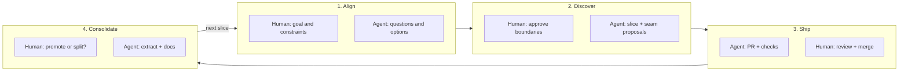

# New initiative workflow — human developer + AI agent

This workflow is a **shared discovery process** between a **human developer** (product, architecture approval, merge) and an **AI agent** (exploration, drafting, refactors). The goal is not to “guess” every package up front: **separation of concerns** and **which `@biblia-studio/*` packages to build** should **emerge** as you learn the problem. The [package map](./02-package-map.md) is a living picture of that—not a fixed straitjacket.

It pairs with the [first-project repo checklist](./10-first-project.md), [GitHub agent workflow](./08-github-agent-workflow.md), and [AI & human workflow](./06-ai-and-human-workflow.md).

---

## Roles (who does what)

| Concern               | Human developer                                                                        | AI agent                                                    |
| --------------------- | -------------------------------------------------------------------------------------- | ----------------------------------------------------------- |
| **Problem & success** | Owns user need, MVP, “done”, risk appetite                                             | Asks clarifying questions; surfaces tradeoffs               |
| **Boundaries**        | Approves **where** domain logic lives (app vs package, new package vs extend existing) | Proposes options with pros/cons; implements what was agreed |
| **Modularity**        | Decides when to **extract** or **merge** packages after seeing real coupling           | Implements extractions; keeps diffs reviewable              |
| **Upstream truth**    | Confirms alignment with Door43 / RC / USFM expectations when ambiguous                 | Links specs; does not invent format rules                   |
| **Delivery**          | Review, request changes, merge; GitHub workflow                                        | Branch, implement, tests, draft PR, respond to review       |

Separation of concerns shows up as: **clear ports**, **thin adapters**, **domain code without UI**, and **packages that earn their existence** (reused or clearly bounded domain).

---

## How package boundaries emerge

You rarely know the final package split before coding. Use this progression:

1. **Sketch** — Human + agent agree on **capabilities** (verbs) and **data flows**, not on folder names only.
2. **Probe** — Implement a **thin vertical slice** in `apps/*` using **hexagonal** wiring: use cases + ports behind the app’s `application/` or `adapters/` ([hexagonal apps](./05-hexagonal-apps.md)). Put exploratory logic **next to** the use case until boundaries stabilize.
3. **Name the seams** — When two concerns pull apart (e.g. “format parsing” vs “Door43 HTTP”), that seam is a candidate for a package or a clearer port.
4. **Promote** — Move stable, reusable code into **`@biblia-studio/*`** when:
   - a second consumer appears, or
   - the boundary is stable enough that duplication would hurt, or
   - the domain is clearly shared (formats, door43, study, …).
5. **Record** — Update [`docs/02-package-map.md`](./02-package-map.md) when a package’s **responsibility** changes or a **new** package is added. For irreversible cuts, add an [ADR](./adr/README.md).

**Anti-patterns:** creating empty packages “because we might need them”; dumping Door43 or USFM rules in React leaves; one giant package that mixes unrelated Bible-tool concerns.

---

## Phases (iterative)

### Phase 1 — Align on the problem (human-led, agent assists)

Answer together (capture in an issue or short doc):

- **User & job to be done** — Who acts, and what do they finish in one session?
- **MVP** — What is “good enough” for the first merge?
- **Non-goals** — What we explicitly defer.
- **Risks** — Data integrity, auth, scripture reference correctness, privacy.

The agent should **not** lock package names here unless already obvious; prefer **capabilities** and **constraints**.

### Phase 2 — Discover boundaries (joint)

- Human: points to relevant **`docs/`** and upstream ([ecosystem references](./01-ecosystem-references.md)).
- Agent: proposes **where** logic might live (existing `@biblia-studio/*` vs app-only vs new package **hypothesis**).
- Together: decide **first slice** (one PR-sized step) and **out of scope** for that slice.

If the call is strategic or ambiguous, open a [**Human decision**](../.github/ISSUE_TEMPLATE/human-decision.yml) issue before large code.

### Phase 3 — Implement and review (agent executes, human verifies)

- **Issue** — [**Agent task**](../.github/ISSUE_TEMPLATE/agent-task.yml) with acceptance criteria reflecting the **slice**, not the whole initiative.
- **Branch & code** — Follow [`AGENTS.md`](../AGENTS.md), [UI philosophy](./04-ui-philosophy.md), hexagonal boundaries.
- **PR** — Draft first; human checks **separation of concerns** in review (ports, adapter thickness, no leaked infrastructure in UI).

### Phase 4 — Consolidate modularity (human decides, agent implements)

After merge (or mid-initiative if debt is high):

- Extract or rename packages; update **package map** and package READMEs.
- Add **ADR** if the boundary is hard to reverse.
- Spawn **follow-up issues** for the next slice—return to Phase 1 for that slice.

---

## Discovery prompts (use in conversation or issue body)

These support **modularity** without pretending we knew the answer on day one:

| Theme         | Prompt                                                                                                              |
| ------------- | ------------------------------------------------------------------------------------------------------------------- |
| **Seams**     | “What would we need to **swap** (mock Door43, offline file, fixture) without rewriting the UI?”                     |
| **Reuse**     | “Will another app or package need this **same** rule in six months?”                                                |
| **Stability** | “Is this API still moving, or ready to **promote** out of `apps/`?”                                                 |
| **Direction** | “Which dependency arrows must **not** exist?” ([package map](./02-package-map.md) direction: foundation ← domains.) |

---

## Phase checklist (compact)

- [ ] **Align** — Goal, MVP, non-goals, risks (human owns).
- [ ] **Discover** — First slice + boundary hypothesis (joint); issue filed.
- [ ] **Ship** — PR with clear seams; CI green; human merge.
- [ ] **Consolidate** — Update package map / ADR / follow-ups when boundaries become clear.

---

## Automation

- **Cursor:** run **`/new-initiative`** in chat to load the agent checklist ([`.cursor/commands/new-initiative.md`](../.cursor/commands/new-initiative.md)).
- **GitHub:** Issues labeled **`agent`** (or title `[agent]…`) and PRs missing `Closes #…` get **one-time** reminder comments ([`initiative-automation.yml`](../.github/workflows/initiative-automation.yml)). Details: [Workflow automation](./12-workflow-automation.md).

---

## Related

- [Package map](./02-package-map.md) — current modules; update as boundaries emerge
- [Hexagonal apps](./05-hexagonal-apps.md) — ports & adapters in `apps/*`
- [First project checklist](./10-first-project.md) — repo readiness
- [GitHub agent workflow](./08-github-agent-workflow.md) — PR + MCP mechanics
- [Milestones & scope](./13-milestones-and-scope.md) — roadmap milestones vs initiatives; drift and escalation
